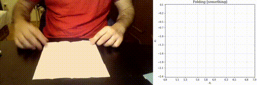
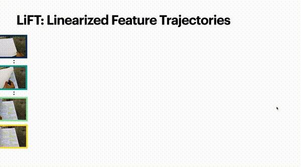
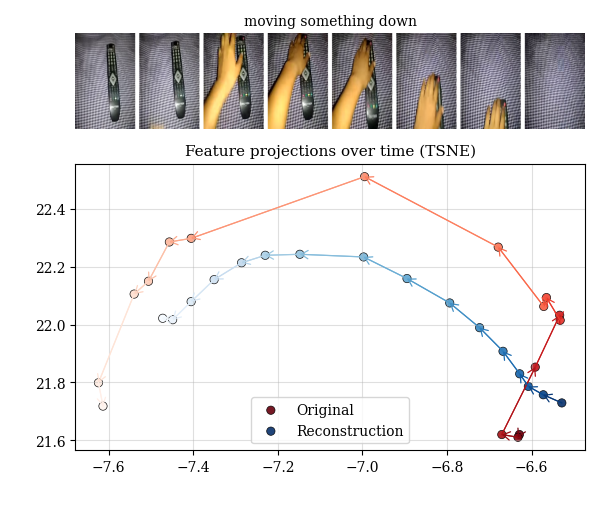

# LiFT: Linearized Feature Trajectories (NeurIPS 2025)

<p align="center">
  <a href="https://bpiyush.github.io/lift-website/"></a>
  <a href="https://huggingface.co/datasets/bpiyush/chirality-in-action"></a>
  <a href="https://neurips.cc/virtual/2025/loc/san-diego/poster/116636"></a>
  <a href="https://github.com/bpiyush/LiFT"></a>
</p>

<h3 align="center">Chirality in Action: Time-Aware Video Representation Learning by Latent Straightening</h3>


<p align="center"><strong>NeurIPS 2025</strong></p>
<p align="center">
  <a href="https://bpiyush.github.io/">Piyush Bagad</a>, &nbsp;
  <a href="https://www.robots.ox.ac.uk/~az/">Andrew Zisserman</a>
</p>
<p align="center">University of Oxford</p>


## Brief Overview

**LiFT** learns time-aware video representations that can linearly separate temporally opposite (chiral) actions like "opening" vs "closing" or "moving up" vs "moving down".

### 🔐 The Key Nugget

**Key observation**: tSNE projections of per-frame features from DINOv2 show that they lie on a time-sensitive trajectory. Can we use these to learn a time-aware video representation?

<p align="center">

</p>

### 🏗️ The Model: LiFT

**Inspired by perceptual straightening**: LiFT transforms non-linear DINO trajectories into a compact video embedding under a linearized Auto-Encoder model, inspired by the perceptual straightening hypothesis [Hénaff et al., Nature 2019].

<p align="center">

</p>

<p align="center">

</p>

**What we contribute:**
- **Model**: LiFT - a compact (768-dim) time-aware video embedding trained in an unsupervised manner
- **Benchmark**: Chirality in Action (CiA) - a new benchmark built from SSv2, EPIC, and Charades datasets to evaluate temporal understanding


## Installation and Setup

Please follow the instructions below to install the dependencies in a `conda` environment called `lift`.
This code is tested on a GPU (NVIDIA RTX A4000) with OS Ubuntu 22.04.5 LTS.

```sh
conda create --name lift python=3.11 -y
conda activate lift

# Install torch
pip install torch==2.6.0 torchvision==0.21.0 torchaudio==2.6.0 --index-url https://download.pytorch.org/whl/cu124

# Install lightning
pip install lightning==2.4.0

# Install other dependencies
pip install einops==0.8.1
pip install timm==1.0.22
pip install decord==0.6.0
pip install matplotlib==3.9.2
pip install opencv-python pandas ipdb ipywidgets tqdm scikit-learn termcolor seaborn ffmpeg-python

# Install gdown for downloading model weights
pip install gdown
```

### Download Model Weights

Download the pre-trained LiFT model weights (~110MB):

```sh
# Download the checkpoint file
gdown 1DFapOrZwRcltyq3_tQNTQ9mHtpgKqtZY -O ggwirp95-epoch=458-step=834003.ckpt
```

Alternatively, you can manually download from [Google Drive](https://drive.google.com/file/d/1DFapOrZwRcltyq3_tQNTQ9mHtpgKqtZY/view?usp=sharing).

## Quick Start (Demo)

LiFT is a video embedding model based on the sequence of
DINOv2 features extracted for T frames of a video.

For basic usage of LiFT, we provide a demo script in `lift/demo.py`.
To run the demo, you can use the following command:

```sh
python lift/demo.py --ckpt_root . --ckpt_name ggwirp95-epoch=458-step=834003.ckpt
```

It will demonstrate the following:

1. Loading DINOv2 backbone and LiFT model (along with its trained checkpoint).
2. Feature extraction for a single video and a batch of videos.
3. Visualization of the DINO trajectory and LiFT reconstruction.

Upon running the demo, you can see the visualization in `lift_output.png`:

<!-- Center the image and add a short caption -->

<p align="left">
  <em>Visualization of the DINO trajectory and LiFT reconstruction.</em>
</p>

## Citation

If you find this work useful, please consider citing:

```bibtex
@InProceedings{BagadLiFT25,
  author       = "Piyush Bagad and Andrew Zisserman",
  title        = "Chirality in Action: Time-Aware Video Representation Learning by Latent Straightening",
  booktitle    = "NeurIPS",
  year         = "2025",
}
```

Please also consider checking out the following papers:
* [Seeing the Arrow of Time in Large Multimodal Models](https://vision.cs.utexas.edu/projects/SeeAoT/). NeurIPS (2025).
* [Retro-Actions: Learning ‘Close’ by Time-Reversing ‘Open’ Videos](https://arxiv.org/abs/1909.09422). ICCVW (2019).
* [Perceptual straightening of natural videos](https://www.nature.com/articles/s41593-019-0377-4). Nature Neuroscience (2019).
